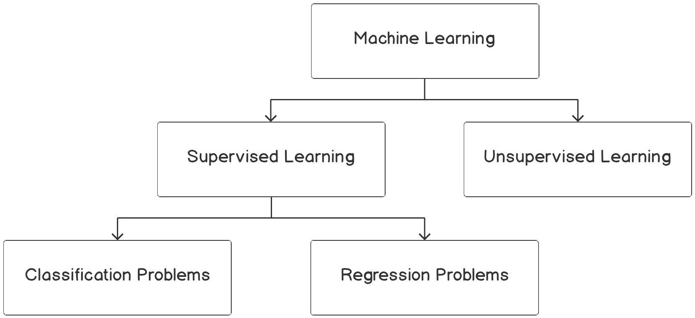

# BinaryClassification

By the end of this lesson, you will be able to formulate a data science problem statement from a business perspective; build hypotheses from various business drivers influencing a use case and verify the hypotheses using exploratory data analysis; derive features based on intuitions that are derived from exploratory analysis through feature engineering; build binary classification models using a logistic regression function and analyze classification metrics and formulate action plans for the improvement of the model.

In this lesson, we will be using a real-world dataset and a supervised learning technique called classification to generate business outcomes.

# Introduction
In previous lesson, where an introduction to machine learning was covered, you were introduced to two broad categories of machine learning; supervised learning and unsupervised learning. Supervised learning can be further divided into two types of problem cases, regression and classification. In the last lesson, we covered regression problems. In this lesson, we will peek into the world of classification problems.

Take a look at the following *Figure 1.1*:

 

<b>Figure 1.1: Overview of machine learning algorithms</b>

Classification problems are the most prevalent use cases you will encounter in the real world. Unlike regression problems, where a real numbered value is predicted, classification problems deal with associating an example to a category. Classification use cases will take forms such as the following:

- Predicting whether a customer will buy the recommended product
- Identifying whether a credit transaction is fraudulent
- Determining whether a patient has a disease
- Analyzing images of animals and predicting whether the image is of a dog, cat, or panda
- Analyzing text reviews and capturing the underlying emotion such as happiness, anger, sorrow, or sarcasm

If you observe the preceding examples, there is a subtle difference between the first three and the last two. The first three revolve around binary decisions:

- Customers can either buy the product or not.
- Credit card transactions can be fraudulent or legitimate.
- Patients can be diagnosed as positive or negative for a disease.

Use cases that align with the preceding three genres where a binary decision is made are called binary classification problems. Unlike the first three, the last two associate an example with multiple classes or categories. Such problems are called multiclass classification problems.
